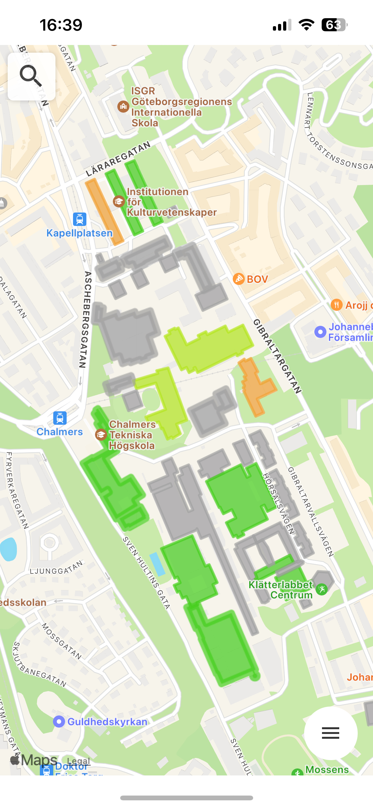
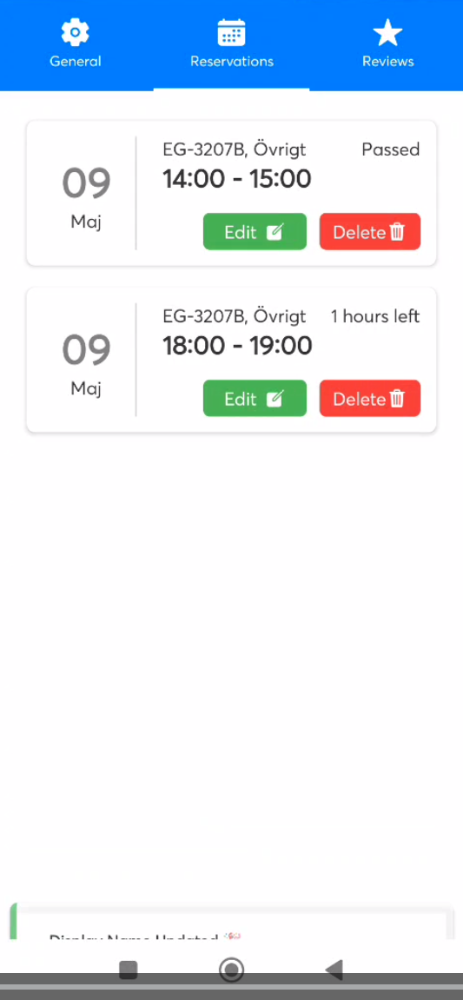
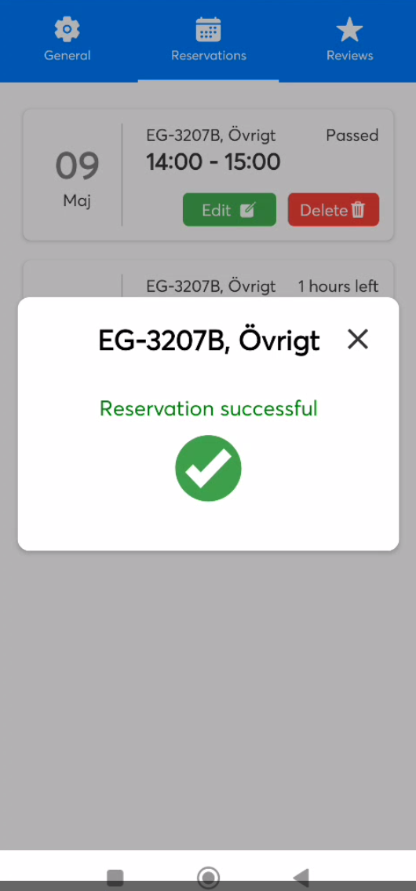
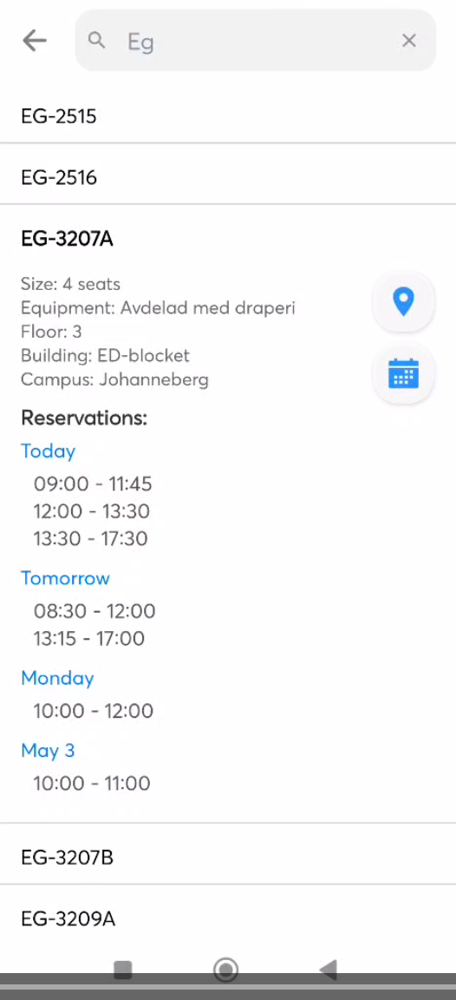

<a name="readme-top"></a>

<!-- PROJECT LOGO -->
<br />
<div align="center">
  <h3 align="center">📖 Chalmers GroupRoom Booking 🎒</h3>

  <p align="center">
    <a href="https://github.com/Chalmers-grouproom-booking-app">View Demo</a>
    ·
    <a href="https://github.com/Chalmers-grouproom-booking-app/issues/new?labels=bug&template=bug-report---.md">Report Bug</a>
    ·
    <a href="https://github.com/Chalmers-grouproom-booking-app/issues/new?labels=enhancement&template=feature-request---.md">Request Feature</a>
  </p>
</div>

Welcome to the Chalmers Group Room Booking app - your ultimate tool for effortlessly booking group rooms at Chalmers University. Navigate through campus buildings with an interactive map and book rooms easily and efficiently.

## Features

- **Interactive Campus Map:** Find your way around Chalmers University with ease. Our detailed map guides you to your desired location.
- **Effortless Booking:** Reserve your group room with just a few clicks. View availability in real-time and plan ahead.
- **Real-time Availability:** Check the status of any group room on campus in real-time. Never miss out on a study spot again.
- **User-Friendly Interface:** Our app is designed with simplicity in mind. Book rooms, navigate campus, and manage your reservations effortlessly.

## Screenshots

<div align="center">
  
  
  
  
</div>

<div align="center">
  
</div>

## Getting Started

### Prerequisites

Before you begin, ensure you have the following installed:
- Node.js
- Python 3.x
- Expo CLI

### Installation

For APP (UI) ✒️
 ```bash
   git clone https://github.com/Chalmers-grouproom-booking-app/app.git
  cd app
  npm install
  npx expo start
 ```

For Backend:📖
```bash
   git clone https://github.com/Chalmers-grouproom-booking-app/backend.git
  cd backend
  pip install -r requirements.txt
  uvicorn main:app --reload
 ```

You are now ready to start using the Chalmers Group Room Booking app locally!

## Contributing

We welcome contributions! Please read our [Contributing Guide](CONTRIBUTING.md) for more information on how you can contribute to the project.

## License

This project is licensed under the MIT License - see the [LICENSE](LICENSE) file for details.

## Acknowledgments

- Chalmers University of Technology
- All contributors and supporters of the project

Thank you for choosing Chalmers Group Room Booking for managing your study sessions. Let's make campus life easier and more efficient together!
